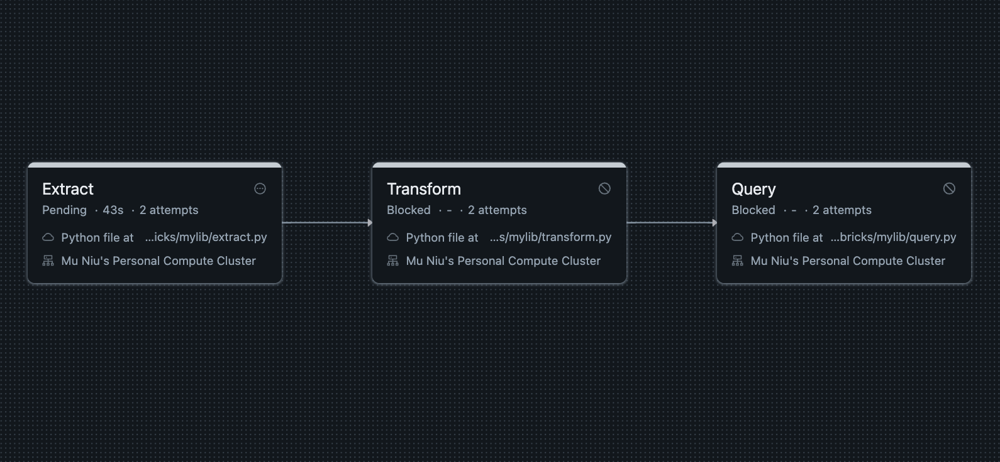

# Mu-Niu-Data-Pipeline-with-Databricks

## Project Overview

This project demonstrates how to create a Databricks Pipeline to manage and analyze student performance data effectively. The dataset includes information about student info, attendance rate, and grade. The pipeline supports operations using PySpark DataFrames, enabling efficient data processing for large datasets.

## Databricks Setup Guide

1. Set up Computing Cluster using default configuration

2. Connecting to Github Repo and link to your account

3. Set up access token, path, and hoster in .env and github secrets

4. Create Job in Databricks Jobs

5. Run Job(got some errors need to be fixed)

---

## ETL Process Overview

The ETL pipeline processes student data using **Python** and **PySpark**. It enables efficient data extracting, transformation, and storage for large datasets.

The pipeline consists of the following tasks:
1. **Extract**: Retrieve data from an online source and save it locally.
2. **Transform and Load**: Clean and process data
3. **Query**: Run SQL queries on the processed data for insights.

### Task Dependencies

Tasks are executed in the following order:

1. **Extract**  
   - Script: `mylib/extract.py`

2. **Transform and Load**  
   - Script: `mylib/transform.py`

3. **Query**  
   - Script: `mylib/query.py`

